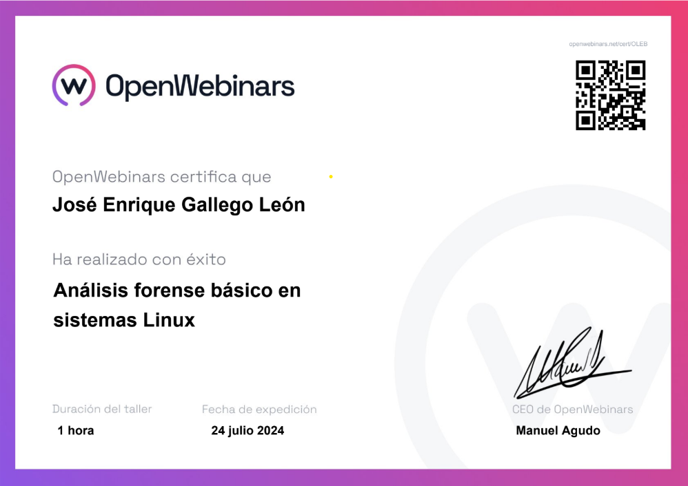

# 📜 Mis Certificaciones Profesionales - OPW

Bienvenido a mi repositorio de certificaciones. Este espacio sirve como un portafolio profesional para alojar y validar las competencias que he adquirido en diversas áreas del marketing digital a través de OPW.

Haz clic en cualquier imagen para ver el certificado PDF completo.

---

## 🚀 Certificaciones Obtenidas

*(Nota: He asignado las imágenes 1.png, 2.png, 3.png, 5.png y 6.png en orden. ¡Asegúrate de que la imagen correcta corresponde al PDF!)*

### 1. OPW Certified Growth Marketing Professional
*Certificación que valida las habilidades en estrategias de crecimiento, experimentación y optimización del funn_el de conversión.*

---

### 2. OPW Certified E-commerce Professional
*Competencias en la creación, gestión y optimización de tiendas online, experiencia de usuario y estrategias de comercio electrónico.*

---

### 3. OPW Certified SEO Professional
*Conocimientos avanzados en optimización para motores de búsqueda (SEO), incluyendo SEO On-Page, Off-Page y técnico.*

---

### 4. OPW Certified Funnel Marketing Professional
*Habilidades para diseñar, implementar y optimizar embudos de ventas y marketing, desde la captación hasta la conversión.*

---

### 5. OPW Certified Email Marketing Professional
*Experiencia en la planificación, ejecución, automatización y análisis de campañas de email marketing efectivas.*

---

### Licencia
El contenido de este repositorio está protegido bajo la [Licencia MIT](./LICENSE).
