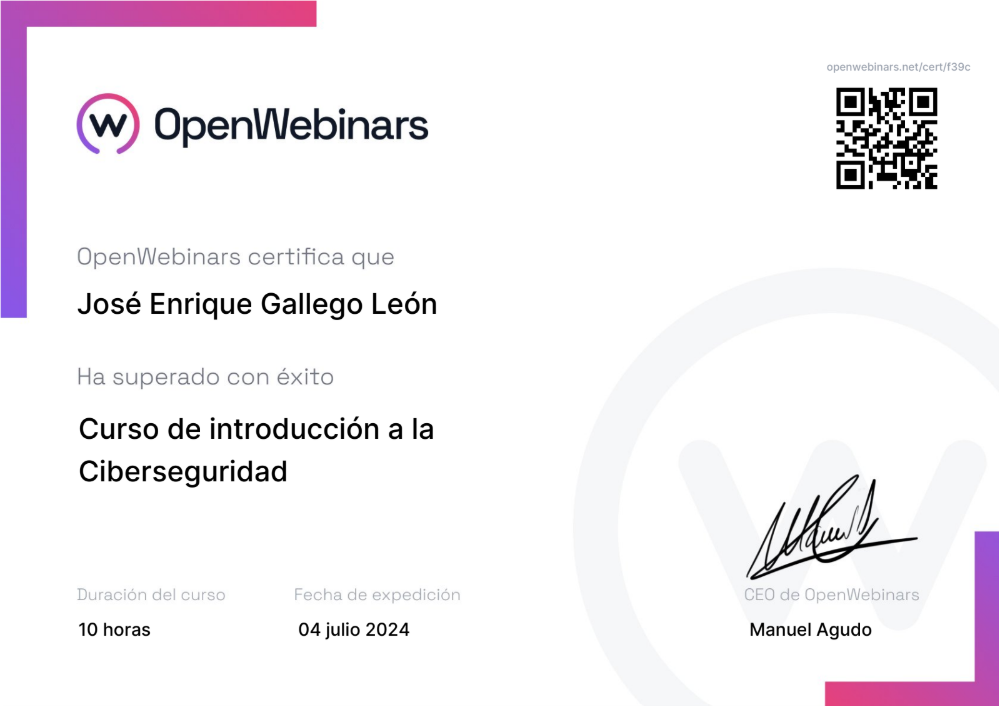
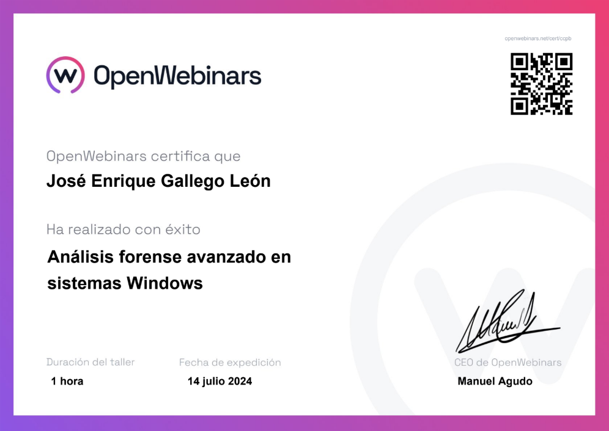
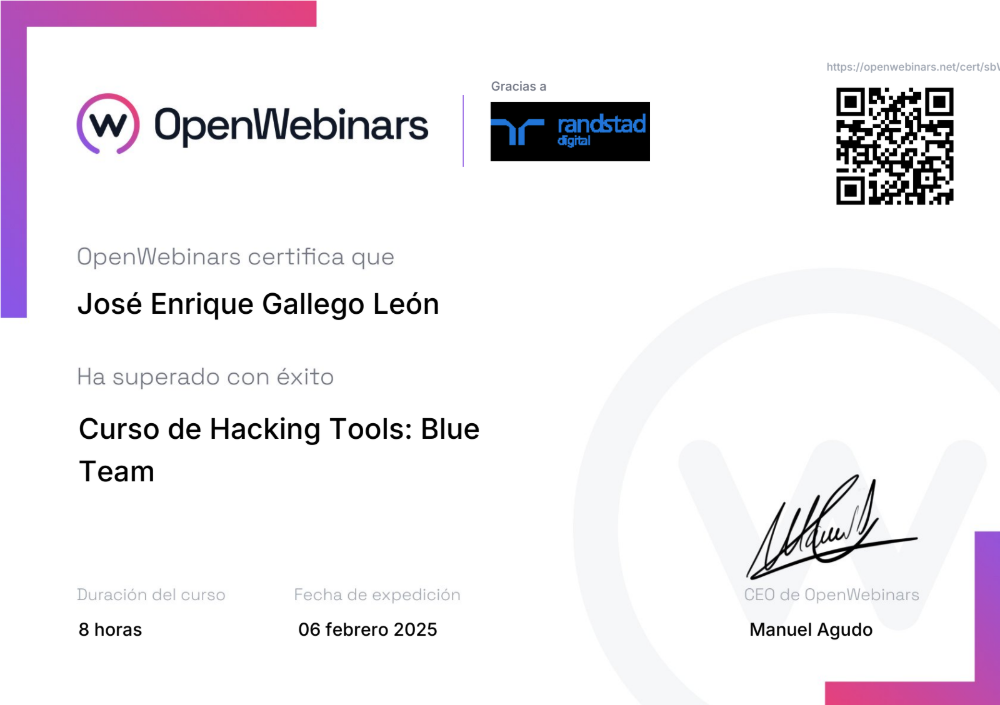

# 📜 Mis Certificaciones Profesionales - OPW

Bienvenido a mi repositorio de certificaciones. Este espacio sirve como un portafolio profesional para alojar y validar las competencias que he adquirido en diversas áreas de la Ciberseguridad a través de OPW.

Haz clic en cualquier imagen para ver el certificado PDF completo.

---

## 🚀 Certificaciones Obtenidas

### 1. OPW - Curso de introducción a la Ciberseguridad
*Certificación que valida las habilidades básicas en Ciberseguridad como la Ciberseguridad física, lógica y políticas de Ciberseguridad.*

---

### 2. OPW - Análisis forense avanzado en sistemas Windows
*Manejo de herramientas forenses en Windows enfocadas en volcado de memoria, clonado de discos y memoria y uso de Volatility.*

---

### 3. OPW Certified SEO Professional
*Conocimientos avanzados en optimización para motores de búsqueda (SEO), incluyendo SEO On-Page, Off-Page y técnico.*

---

### 4. OPW Certified Funnel Marketing Professional
*Habilidades para diseñar, implementar y optimizar embudos de ventas y marketing, desde la captación hasta la conversión.*

---

### 5. OPW Certified Email Marketing Professional
*Experiencia en la planificación, ejecución, automatización y análisis de campañas de email marketing efectivas.*

---

### Licencia
El contenido de este repositorio está protegido bajo la [Licencia MIT](./LICENSE).
